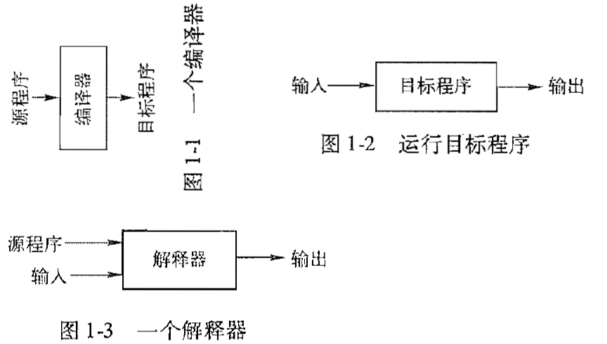
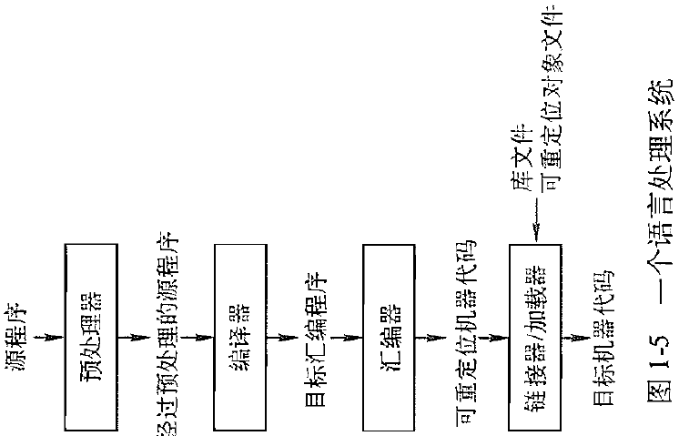
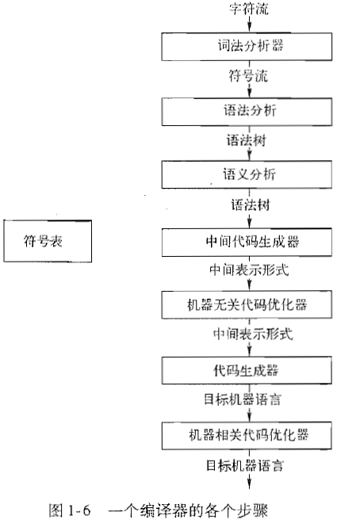
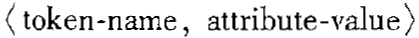
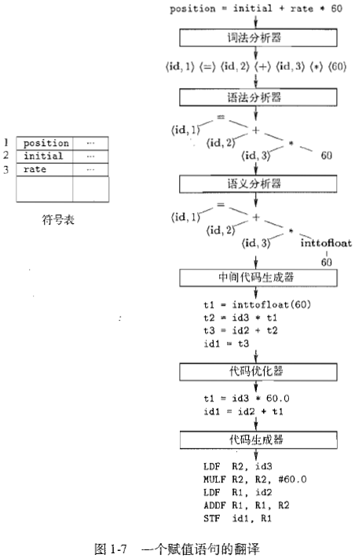

## 1 引论

### 1.1 语言处理器

编译器就是一个程序，可以阅读以某一种语言（源语言）编写的程序，并把该程序翻译成一个等价的，用另一种语言（目标语言）编写的程序。同时报告它在翻译过程中发现的源程序中的错误，如果有的话。

解释器直接利用用户提供的输入执行源程序中指定的操作。

编译器和解释器的对比

编译器编译完后的目标程序运行起来更快，解释器的错误诊断效果更好，因为它逐个语句地执行源程序

java 语言介于编译型语言和解释型语言之间。

一个 java 源程序首先被编译成一个称为**字节码**（bytecode）的中间表示形式。然后由一个虚拟机对得到的字节码加以解释执行。这样做的好处是在一台机器上编译得到的字节码可以在另一台机器上解释执行。

为啥要分为上述几个步骤呢，我觉得是软件工程学的原因。编写一个源程序时必然要用到现成的模块（标准库函数，现成的框架）和可能被分割成多个模块，并存放于独立的文件中。把程序聚合在一起的任务由预处理器完成。预处理还负责把那些称为宏的缩写形式转换为源语言的语句。

经过预处理的源程序作为输入传递给编译器。编译器可能产生一个汇编语言作为其输出，因为汇编语言比较容易输出和调试。

汇编语言程序由汇编器处理生成可重定位的机器代码。

大型程序经常被分成多个部分进行编译，因此，可重定向的机器代码有必要和其他可重定位的目标文件和库文件连接到一起，形成真正在机器上运行的代码。一个文件中的代码可能指向另一个文件中的位置，而链接器能够解决外部内存地址的问题。

加载器把所有可执行目标文件放到内存中执行。

### 1.2 一个编译器的结构

编译器能够完成源程序到目标程序的映射，过程由两个部分组成：分析部分和综合部分。

分析（analysis）部分把源程序分解为多个组成要素，并在这些要素上加上语法结构。然后，它使用这个结构来创建该源程序的一个中间表示。如果分析部分检查出源程序每个按照正确的语法构成，或者语义上不一致，它就必须提供有用的信息，使得用户可以按此进行改正。分析部分还会收集有关源程序的信息，并把信息存放在一个称为符号表（symbol table）的数据结构中。符号表将和中间表示形式一起传送个综合部分。

综合（synthesis）部分根据中间表示和符号表中的信息来构造用户期待的目标程序。分析部分经常被称为前端，综合部分被为后端。

编译器实际上是顺序执行了一组步骤（phase）。每个步骤八源程序的一种表示方式转换成另一种表示方式。一个典型的八编译程序分解为多个步骤的方式如下：

而实际上，多个步骤可能被组合在一起，而这些组合在一起的步骤之间的中间表示不需要被明确地构造出来。存放整个源程序的信息的符号表可由编译器的各个步骤使用。

有些编译器在前端和后端之间有一个与机器无关的优化步骤。这个优化步骤是在中间表示之上进行转换，以便后端能够生成更好的目标程序。如果基于未经过此优化步骤的中间表示来生成代码，则代码的质量会受到影响。优化是可选的

#### 1.2.1 词法分析

词法分析器读入组成源程序的字符流，并且将它们组织成有意义的词素（lexeme）的序列。对于每个词素，词法分析器产生如下形式的词法单元（token）作为输出：

这个词法单元被传送给下一个步骤，即语法分析。在这个词法单元中，第一个分量 token-name 是一个由语法分析步骤使用的抽象符号，而第二个分量 attribute-value 指向符号表中关于这个词法单元的条目。符号表条目的信息会被语义分析和代码生成步骤使用。

具体的由词素到词法单元的分析过程示例见龙书。

