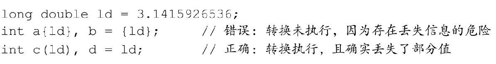
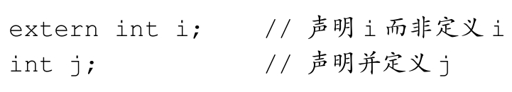

## 1 c/c++ 简介

### 1.1 c 语言

### 1.2 c 语言编程原理

c 语言理论上可以实现 oop，但是代价比较大，毕竟不是原生支持。c 语言原生支持**结构化编程**，是一种过程性语言。

### 1.3 面向对象编程

与强调算法的过程性编程不同的是，oop 强调的是数据。oop 不像过程性编程那样，试图使问题满足语言的过程性方法，而是试图让语言来满足问题的要求。其理念是设计与问题的本质特性相对应的数据格式。

在 c++ 中，类是一种规范，它描述了这种新型数据格式，对象是根据这种规范构造的特定数据结构。通常，类规定了可使用那些数据来表示对象以及可以对这些数据执行哪些操作。oop 程序设计方法首先设计类，他们准确地表示了程序要处理的东西。类定义描述了对每个类可执行的操作。从低级组织（如类）到高级组织（如程序）的处理过程叫做自下而上（bottome-up）的编程。

oop 编程并不仅仅是将数据和方法合并为类定义。例如，oop 还有助于创建可重用的代码，这将减少大量的工作。信息隐藏（封装）可以保护数据，使其免遭不适当的访问。多态让你能够为运算符和函数创建多个定义（静态多态和动态多态），通过编程上下文来确定使用哪个定义。继承让你能够使用旧类派生出新类。

其实设计有用，可靠的类是一项艰巨的任务，对程序员的要求很高。所以 C++ 的优点是通过 OOP 使得程序员可以方便地重用和修改现有的，经过仔细测试过的类代码。

### 1.4 c++ 和泛型编程

它与 OOP 的目标相同，即使重用代码和抽象通用概念的技术更简单。不过 OOP 强调的是编程的数据方面，而泛型编程强调的是独立于特定数据类型。OOP 是一个管理大型项目的工具，而泛型编程提供了执行常见任务（如对数据排序或合并链表）的工具。术语泛型（generic）指的是创建独立于类型的代码。C++ 的数据表示有多种类型——整数、小数、字符、字符串、用户定义的、由多种类型组成的复合结构。例如，要对不同类型的数据进行排序，通常必须为每种类型创建一个排序函数。泛型编程需要对语言进行扩展，以便可以只编写一个泛型（即不是特定类型的）函数，并将其用于各种实际类型。**C++ 模板**提供了完成这种任务的机制。

## 2 变量和基本类型

### 2.1 基本内置类型

#### 2.1.1 算术类型

整型和浮点型。且有长度之分

#### 2.1.2 类型转换

类型转换系统是很精妙的东西

#### 2.1.3 字面值常量

以 0 开头的整数代表八进制数，以 0x 或 0X 开头的代表十六进制数。

**转义序列**

### 2.2 变量

对于 c++ 程序员来说，变量（variable）和对象（object）一般可以互换使用。

#### 2.2.1 变量定义

在 c++ 中，初始化是一个异常复杂的问题。

**列表初始化**

作为 c++11 新标准的一部分，用花括号初始化变量得到了全面的应用，这种初始化的形式被称为列表初始化。

当用于内置类型的变量时，这种初始化形式有一个重要的特点：如果我们使用列表初始化且初始值存在丢失风险时，编译器将报错：

**默认初始化**

定义变量的时候没有指定初始值，变量就被赋予默认值。默认值到底是什么有变量类型决定，同时定义变量的位置也会对此有影响。

如果是内置类型的变量未被显示初始化，它的值由定义的位置决定。定义于任何函数体之外的变量被初始化未 0。定义在函数体内部的内置类型变量将不被初始化。试图拷贝或以其他形式访问此类值将引发错误。

每个类各自决定其初始化对象的方式。而且，是否允许不经初始化就定义对象也由类自己决定。如果类允许这种行为，它将决定对象的初始值到底是什么。一些类要求每个对象都显示初始化（目前能想到的是，当构造函数声明为私有成员函数时，需要显示初始化），此时如果创建了该类的对象而未对其做明确的初始化操作，将引发错误。

#### 2.2.2 变量声明和定义的关系

为了支持分离式编译，C++ 将声明和定义区分开来。声明（declaration）使得名字为程序所知，一个文件如果想要使用别处定义的名字则必须包含对那个名字的声明。而定义（definition）负责创建与名字关联的实体。

如果想声明一个变量而非定义它，就在该变量名前加上关键字 extern，而且不要显示地初始化变量：

#### 2.2.3 标识符

#### 2.2.4 名字的作用域

作用域是程序的一部分，在其中名字有特殊的含义。C++ 语言中大多数作用域都以花括号分隔。

### 2.3 复合类型

复合类型是基于其他类型定义的类型。

### 2.4 const 限定符

**const修饰指针**

三种情况

1.  const 修饰指针 --- 常量指针，const int *p = &a；**指针的指向可以修改，指针指向的值不可以修改** 

2.  const 修饰常量 --- 指针常量,	int * const p = &a；**指针的指向不可以改，指针指向的值可以改**

3.  const 既修饰指针，又修饰常量，const int * const p = &a；**指针的指向和指针指向的值都不可以改**

### 2.5 处理类型

### 2.6 自定义数据结构

## 3 字符串向量和数组

## 4 表达式

## 5 语句

## 6 函数

## 7 类

类，定义了数据的存储和使用方式。类是用户定义的一种数据类型。要定义类，要描述它能够表示什么信息和对数据进行什么操作。类之于对象就像定义之于变量。函数调用和运算符重载，都可以用来向类的对象发送消息。面向对象编程的本质是设计并扩展自己的数据类型。

类定义了如何表示和控制数据。成员函数归类所有，描述了描述了操纵类数据的方法。

### 7.1 定义抽象数据类型

#### 7.1.5 拷贝，赋值和析构

除了定义类的对象如何初始化之外，类还需要控制拷贝，赋值和销毁对象时发生的行为。对象在几种情况下会被拷贝，如我们初始化变量以及以值的方式传递或返回一个对象等。当我们使用了赋值运算符时会发生对象的赋值操作。当对象不再存在时执行相会的操作。

如果我们不主动定义这些操作，则编译器将替我们合成它们。

### 7.2 访问控制与封装

在 c++ 中，我们使用访问说明符来加强类的封装：

-   定义在 public 说明符之后的成员在整个程序内可被访问，public 成员定义类的接口
-   定义在 private 说明符之后的成员可以被类的成员函数访问，但是不能被使用该类的代码访问，private 部分封装了类的实现细节。

**使用 class 或 struct 关键字**

类可以在它的第一个访问说明符之前定义成员，对这种成员的访问权限依赖于类定义的方式。如果我们使用 struct 关键字，则定义在第一个访问说明符之前的成员是 public 的；相反，如果用的是 class 关键字，则这些成员是 private 的

#### 7.2.1 友元

类可以允许其他类或者函数访问它的非公有成员，方法是令其他类或函数成为它的友元（friend）。如果类想把一个函数作为它的友元，要增加一条以 friend 关键字开始的函数声明语句。

### 7.3 类的其他特性

可变数据成员

mutable

### 7.4 类的作用域

### 7.5 构造函数再探

### 7.6 类的静态成员

**声明静态成员**

我们通过在成员的声明之前加上关键字 static 使得器与类关联在一起。

类的静态成员存在于任何对象之外，对象中不包含任何与静态数据成员有关的数据。静态成员函数页不与任何对象绑定在一起，它们不包含 this  指针。

