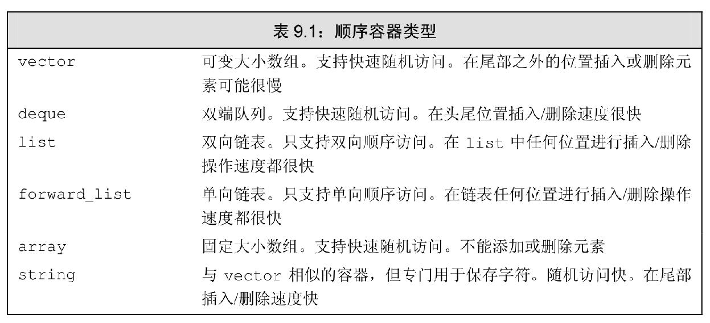
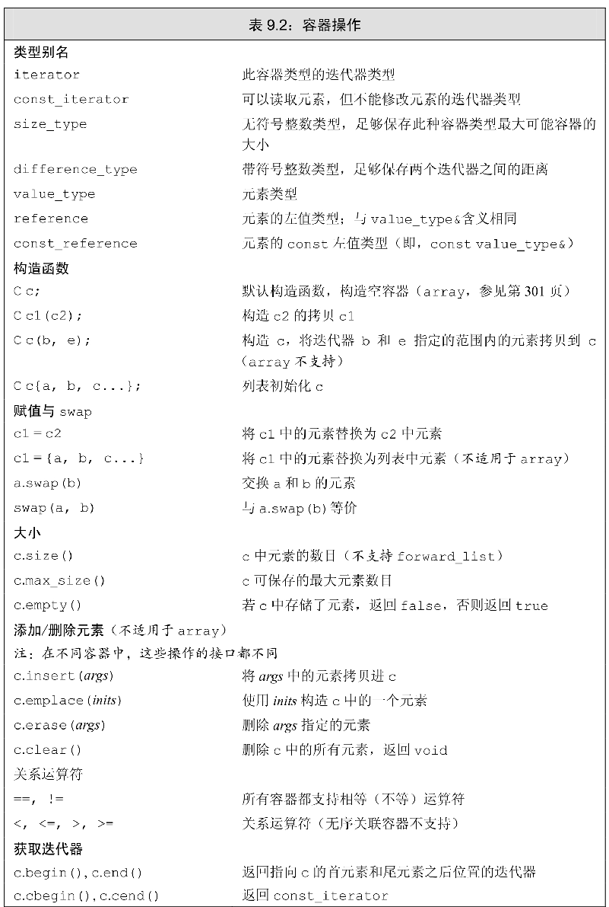
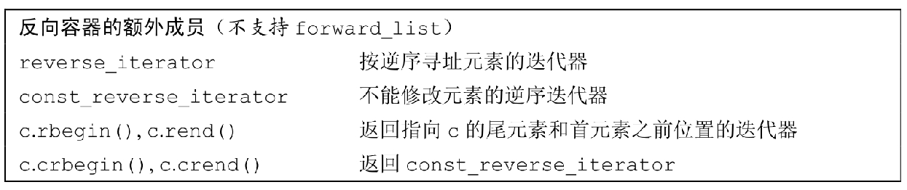
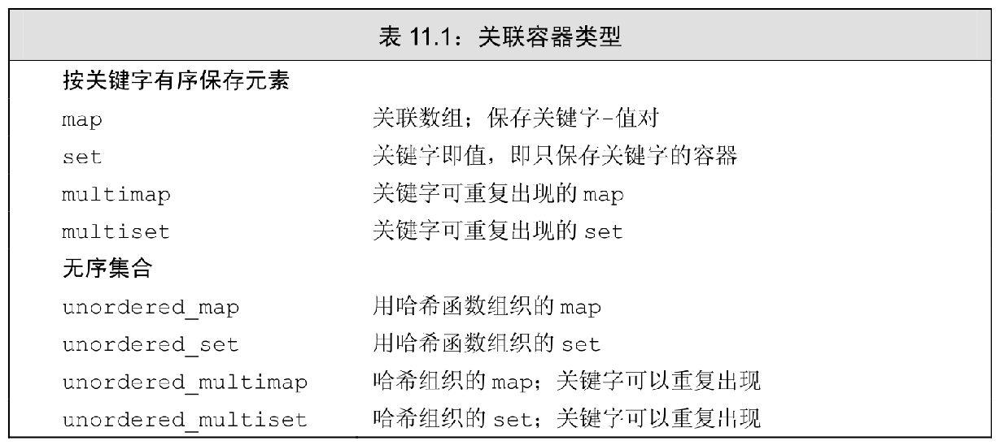

## c++ 标准库

标准库的核心是很多容器类和一族泛型算法，这些基础设施能帮助我们 编写简洁高效的程序。标准库会去关注那些繁琐操作的细节，特别是内存管理，这样程序就可以把全部注意力投入到需要求解的问题上。

## 8 IO 库


## 9 序容器

元素在序容器中的顺序与其加入容器时的位置相对应。关联容器中元素的位置由元素相关联的关键字决定。所有容器类都共享公共的接口，不同容器按不同的方式对其进行扩展。每种容器都提供了不同的性能和功能的权衡。一个容器就是一些特定类型对象的集合。顺序容器为程序员提供了控制元素存储和访问顺序的能力。这种顺序不依赖于元素的值，而是于元素加入容器时的位置相对应。标准库还提供了三种容器适配器，分别为容器操作定义了不同的接口，来与容器类型适配

### 9.1 顺序容器概述

所有的顺序容器都提供了快速顺序访问元素的能力。但是，这些容器在以下方面都有不同的性能折中：

-   向容器添加或从容器中删除元素的代价
-   非顺序访问容器中元素（随机访问）的代价



### 9.2 容器库概览





#### 9.2.1 迭代器

**迭代器范围**

一个迭代器范围由一对迭代器表示，两个迭代器分别指向同一个容器中的元素或者时尾元素之后的位置。这两个迭代器通常被称为 begin 和 end。第二个迭代器从来都不会指向范围中的最后一个元素，而是指向尾元素之后的位置。元素范围是一个左闭合区间，其标准数学描述为 [begin, end)。

#### 9.2.2 容器类型成员

list::splice

实现拼接功能，将源 list 的内容部分或全部元素删除，并插入到目的 list

函数有以下三种声明：

一：void splice ( iterator position, list<T,Allocator>& x );

二：void splice ( iterator position, list<T,Allocator>& x, iterator it );

三：void splice ( iterator position, list<T,Allocator>& x, iterator first, iterator last );

解释：

position 是要操作的list对象的迭代器

list&x 被剪的对象

对于一：会在position后把list&x所有的元素到剪接到要操作的list对象

对于二：只会把it的值剪接到要操作的list对象中

对于三：把first 到 last 剪接到要操作的list对象中

### 9.4 vector 对象是如何增长的

当不得不获取新的内存空间时，vector 和 string 的实现通常会分配比新的空间需求更大的内存空间。容器预留这些空间作为备用，可用来保存更多的新元素。

## 10 泛型算法

标准库容器定义的操作集合惊人的小。标准库并未给每个容器添加大量功能，而是提供了一组算法，这些算法中的大多数都独立于任何特定的容器。这些算法是通用的：它们可用于不同类型的容器或不同类型的元素。

顺序容器只定义了很少的操作：在多数情况下，我们可以添加和删除元素，访问 首尾元素，确定容器是否为空以及获得指向首元素或尾元素之后位置的迭代器。

查找特定元素，替换和删除一个特定值，重排元素顺序等操作在标准库中并没有给每个容器定义为成员函数。标准库定义了一组泛型算法。

### 10.1 概述

大多数算法都定义在头文件 algorithm 中。头文件 numeric 中定义了一组数值泛型算法。

一般情况下，这些算法并不直接操作容器，而是遍历由两个迭代器指定的一个元素范围来进行操作。

### 10.2 初识泛型算法

#### 10.3.2 lambda 表达式

根据算法接受一元谓词还是二元谓词，我们传递给算法的谓词必须严格接受一个或两个参数。但是，有时我们希望进行的操作需要更多参数，超出了算法对谓词的限制。

## 11 关联容器

关联容器支持高效的关键字查找和访问。两个主要的关联容器是 map 和 set。map 中元素是一些关键字-值（key-value）对；关键字起到索引的作用，值则表示与索引相关联的数据。set 中每个元素只包含一个关键字；set 支持高效地阿关键字查询操作，即检查一个给定关键字是否在 set 中。

标准库提供 8 个关联容器。这 8 个容器间的不同体现在三个维度上：

1.   每个容器或者是一个 map 或者是一个 set；
2.   或者要求不重复关键字，或者允许重复关键字
3.   按顺序保存元素，或者无序保存。

允许重复关键字的容器的名字中都包含单词 multi。不保持关键字按顺序存储的容器的名字都以单词 unordered 开头。




## 12 动态内存

除了自动和 static 对象外，c++ 还支持动态分配对象。动态分配的对象的生存期与它们在哪里创建时无关的，只有当显示地被释放时，这些对象才会销毁。

动态对象的正确释放被**证明**是编程中极其容易出错的地方。为了更安全地使用动态对象，标准库定义了两个智能指针类型来管理动态分配的对象。当一个对象应该被释放时，指向它的智能指针可以确保自动地释放它。

除了静态内存和栈内存，每个程序还拥有一个内存池。这部分内存被称作堆。程序用堆来存储动态分配的对象–即，那些在程序运行时分配的对象。动态对象的生存期有程序来控制，也就是说，当动态对象不再使用时，我们的代码必须显示地销毁它们。

### 12.1 动态内存和智能指针

在 C++ 中动态内存管理是通过 new，在动态内存中为对象分配空间并返回一个指向该对象的指针，我们可以选择对对象进行初始化；delete，接受一个动态对象的指针，销毁该对象，并释放与之关联的内存。

忘记释放就是内存泄漏；尚有指针引用内存的时候释放就产生非法引用内存。

为了更容易（同时也为了更安全）地使用动态内存，新的标准库提供了两种智能指针类型来管理动态对象。智能指针的行为类似常规指针，重要的区别是它负责自动释放所指向的对象。新标准库提供的这两种智能指针的区别在于管理底层指针的方式：shared_ptr 允许多个指针指向同一对象；unique_ptr 则“独占”所指向的对象。标准库还定义了一个 weak_ptr 的伴随类，它是一种弱引用，指向 shared_ptr 所管理的对象。

#### 12.1.1 shared_ptr 类

类似 vector，智能指针也是模板。因此，当我们创建一个智能指针的时候，必须提供额外的信息–指针可以指向的类型。

**make_shared 函数**

最安全的分配和使用动态内存的方法是调用名为 make_shared 的函数。此函数在动态内存中分配一个对象并初始化它，返回指向此对象的 shared_ptr。

**shared_ptr 的拷贝和赋值**

当进行拷贝和赋值时，每个 shared_ptr 都会记录有多少个其他 shared_ptr 指向相同的对象。

```c++
auto p = make_shared<int>(88); // p 指向的对象只有 p 一个引用者
auto q(p); // p 和 q 指向相同对象，此对象有两个引用者。
```

我们可以认为每个 shared_ptr 都有一个关联的计数器，通常称其为引用计数。无论何时我们拷贝一个 shared_ptr，计数器都会递增。例如，当用一个 shared_ptr 初始化另一个 shared_ptr，或将它作为参数传递给一个函数（参见6.2.1节，第188页）以及作为函数的返回值（参见6.3.2节，第201页）时，它所关联的计数器就会递增。当我们给 shared_ptr 赋予一个新值或是 shared_ptr 被销毁（例如一个局部的 shared_ptr 离开其作用域（参见6.1.1节，第184页））时，计数器就会递减。

一旦一个 shared_ptr 的计数器变为 0，它就会自动释放自己所管理的对象。

**shared_ptr 自动销毁所管理的对象**

当指向一个对象的最后一个 shared_ptr 被销毁时，shared_ptr 类会自动销毁此对象。它是通过另一个特殊的成员函数–析构函数来完成销毁工作的。

**shared_ptr 还会自动释放相关联的内存**

**使用了动态生存期的资源的类**

程序使用动态内存出于以下三种原因之一：

1.   程序不知道自己需要多少对象
2.   程序不知道所需对象的准确类型
3.   程序需要在多个对象间共享数据

#### 12.1.5 unique_ptr

一个 unique_ptr 拥有它所指向的对象。与 shared_ptr 不同，某个时刻只能有一个 unique_ptr 指向一个给定对象。当 unique_ptr 被销毁时，它所指向的对象也被销毁。

12.1.6 weak_ptr 

weak_ptr 是一种不控制所指向对象生存期的智能指针，它指向由一个 shared_ptr 管理的对象。将一个 weak_ptr 绑定到一个 shared_ptr 不会改变 shared_ptr 的引用计数。一旦最后一个指向对象的 shared_ptr 被销毁，对象就会被释放。即使有 weak_ptr 指向对象，对象还是会被释放。
