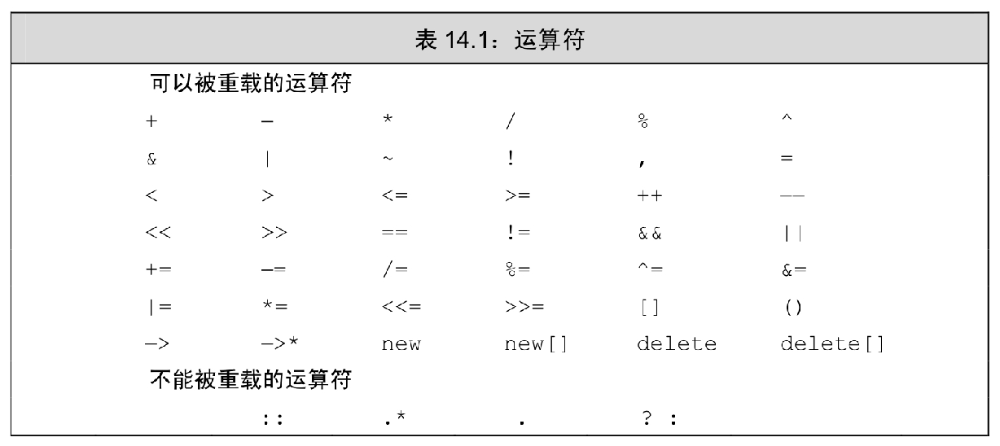

## 13 拷贝控制

类如何控制该类型对象拷贝，赋值，移动或销毁时做什么。

类通过一些特殊的成员函数控制这些操作，包括，拷贝构造函数，移动构造函数，拷贝赋值运算符，移动赋值运算符以及析构函数。

**深拷贝和浅拷贝**

浅拷贝：简单的赋值拷贝操作，如果赋值的值中包括指针，然后指针会指向一个在堆区分配的空间，对象释放时调用析构函数会释放堆区的空间。那么拷贝的对象在释放时也会用析构函数释放堆区的空间，从而导致堆区的内存重复释放。

示例代码如下：

```c++
class Person
{
public:
    //构造函数，没有返回值，不用写void
    //可以有参数，可以发生重载
    Person()
    {
        cout<< "Person 默认（无参）构造函数的调用" << endl;
    }

    Person(int val, int height)
    {
        age = val;
        height_ = new int(height);
        cout << "Person 有参构造函数的调用" << endl;
    }

    //拷贝构造函数，拷贝一个已有对象的属性, const确保只读，并且只能用引用的方式传参
    Person(const Person &person)
    {
        //将传入的对象的所有属性，拷贝过来。
        age = person.age;
        height_ = person.height_;
        cout<< "Person 拷贝构造函数的调用" << endl;
    }

    //析构函数，没有返回值，不用写void
    //函数名和类名相同，在名称前加 ~
    //析构函数没有参数，不可以重载
    ~Person()
    {
        //析构函数，将堆区开辟的数据做释放操作
        if(height_ != nullptr)
        {
            delete height_;
            height_ = nullptr;
        }
        cout << "Person 析构函数的调用" << endl;
    }

public:
    int age;
    int *height_;
};

// 深拷贝和浅拷贝
void test01()
{
    Person person(18, 160);
    Person person2(person);

    cout << "p1的年龄为： " << person.age <<  "身高为： " << *person.height_  << endl;
    cout << "p2的年龄为： " << person2.age << "身高为： " << *person2.height_  << endl;


}


int main()
{
    test01();
    return 0;
}
```

深拷贝：拷贝构造函数中在堆区重新申请空间，进行拷贝操作，析构函数释放堆区内存就不会重复释放内存，示例代码如下：

```c++
class Person
{
public:
    //构造函数，没有返回值，不用写void
    //可以有参数，可以发生重载
    Person()
    {
        cout<< "Person 默认（无参）构造函数的调用" << endl;
    }

    Person(int val, int height)
    {
        age = val;
        height_ = new int(height);
        cout << "Person 有参构造函数的调用" << endl;
    }

    //拷贝构造函数，拷贝一个已有对象的属性, const确保只读，并且只能用引用的方式传参
    Person(const Person &person)
    {
        //将传入的对象的所有属性，拷贝过来。
        age = person.age;
        height_ = new int(*person.height_); //深拷贝，重新在堆区分配内存空间
        cout<< "Person 拷贝构造函数的调用" << endl;
    }

    //析构函数，没有返回值，不用写void
    //函数名和类名相同，在名称前加 ~
    //析构函数没有参数，不可以重载
    ~Person()
    {
        //析构函数，将堆区开辟的数据做释放操作
        if(height_ != nullptr)
        {
            delete height_;
            height_ = nullptr;
        }
        cout << "Person 析构函数的调用" << endl;
    }

public:
    int age;
    int *height_;
};

// 深拷贝和浅拷贝
void test01()
{
    Person person(18, 160);
    Person person2(person);

    cout << "p1的年龄为： " << person.age <<  "身高为： " << *person.height_  << endl;
    cout << "p2的年龄为： " << person2.age << "身高为： " << *person2.height_  << endl;


}


int main()
{
    test01();
    return 0;
}
```

如果属性有在堆区开辟的，一定要提供拷贝构造函数，防止浅拷贝带来的问题。

## 14 重载运算与类型转换

当运算符被用于类类型的对象时，c++ 语言允许我们为其指定新的含义；同时，我们也能自定义类类型之间的转换规则。和内置类型的转换一样，类类型转换隐式地将一种类型的对象转换称另一种我们所需类型的对象。当运算符作用域类类型的运算对象时，可以通过运算符重载重新定义该运算符的含义。



## 15 面向对象程序设计

### 15.1 oop 概述

面向对象程序设计基于三个基本概念：数据抽象（封装），继承和动态绑定（动态多态）。

继承和动态绑定对程序的编写有两方面的影响：一是我们可以更容易地定义与其他类相似但不完全相同的新类；而是在使用这些彼此相似的类编写程序时，我们可以在一定程度上忽略掉它们的区别。

通过数据抽象，将类的接口与实现分离；使用继承，可以定义相似的类型并对其相似关系建模；使用动态绑定，可以在一定程度上忽略相似类型的区别，而以统一的方式使用它们的对象。

**继承**

通过继承联系在一起的类构成一种层次关系。通常在层次关系的根部有一个基类，而其他类则直接或间接地从基类继承而来，这些继承得到的类称为派生类。基类负责定义在层次关系中所有类共同拥有的成员，而每个派生类定义各自特有的成员。

在 c++ 语言中，基类将类型相关的函数与派生类不做改变直接继承的函数区分对待。对于某些函数，基类希望它的派生类个自定义适合自身的版本，此时基类就将这些函数声明称虚函数。派生类必须在其内部对所有重新定义的虚函数进行声明。允许派生类显示地注明它将使用哪个成员函数改写基类的虚函数，具体措施是在该函数的形参列表中之后增加一个 override 关键字。

### 15.2 定义基类和派生类

**访问控制与继承**

派生类可以继承定义在基类中的成员，但是派生类的成员函数不一定有权访问从基类继承而来的成员。和其他使用基类的代码一样，派生类能访问公有成员，而不能访问私有成员。不过在某些时候基类中还有这样一种成员，基类希望它的派生类成员有权访问该成员，同时禁止其他用户访问。我们用 protected 访问运算符说明这样的成员。

继承的语法： `class 子类 : 继承方式 父类`

继承方式一共由三种：

-   公共继承：公共成员和保护成员到子类依然是公共成员和保护成员，私有成员到子类不可访问
-   保护继承：公共成员和保护成员到子类都变成保护成员，私有成员到子类不可访问
-   私有继承：公共成员和保护成员到子类都变成私有成员，私有成员到子类不可访问

**继承中的对象模型**

从父类继承过来的成员，哪些属于子类对象中？

父类中所有非静态成员属性都会被子类继承下去

父类中私有成员属性，被编译器隐藏了，访问不到，但是确实被继承下去了。

**继承中的构造和析构顺序**

子类继承父类后，当创建子类对象，也会调用父类的构造函数

问题：父类和子类的构造和析构顺序是谁先谁后？

继承中先调用父类的构造，再调用子类的构造，子类先调用析构，父类后调用析构

**继承同名成员处理方式**

当子类与父类出现同名的成员，如何通过子类对象，访问到子类或父类中同名的数据呢？

-   访问子类同名成员 直接访问即可
-   访问父类同名成员 需要加作用域

如果子类中出现和父类同名的成员函数，子类的同名成员函数回隐藏掉父类中的所有（重载）同名成员函数，如果想访问，需要加作用域

**继承同名静态成员处理方式**

继承中同名的静态成员在子类对象上如何进行访问

静态成员和非静态成员出现同名，处理方式一致

-   访问子类同名成员 直接访问即可
-   访问父类同名成员 需要加作用域

总结：同名静态成员处理方式和非静态处理方式一样，只不过有两种访问的方式（通过对象 和 通过类名）

**多继承语法**

c++允许**一个类继承多个类**

语法：`class 子类 : 继承方式 父类1 , 继承方式 父类2...`

多继承可能回引发父类中有同名成员出现，需要加作用域区分

**c++实际开发中不建议用多继承**

**菱形继承**

概念：

1.  两个派生类同时继承一个基类
2.  又有某个类同时继承两个派生类
3.  这种继承被称为菱形继承，或者叫做钻石继承

当出现菱形继承，两个父类拥有相同数据，需要加以作用域区分

利用虚继承可以解决菱形继承的问题，在继承之前加上关键字：virtual

原理：虚基类，最大的类。

虚基类指针：从父类继承下来的vbptr，指向vbtable，记录偏移量，加上偏移量，会找到唯一一个数据成员。最终保存的成员只有一个。

### 15.3 虚函数

当某个虚函数通过指针或引用调用时，编译器产生的代码直到运行时才能确定应该调用哪个版本的函数。被调用的函数时绑定到指针或引用上的对象的动态类型相匹配的那一个。

虚函数实现原理：

vfptr ：虚函数表指针，指向一个虚函数表，vftable，表内部记录记录一个虚函数地址。再有虚函数的类的实例中这个表被分配在了实例的内存中。当用基类的指针和引用操作一个子类的时候，这张虚函数表就像一个地图一样，指示该调用哪个函数。


### 15.5 访问控制与继承

**受保护的成员**

派生类的成员或友元只能通过派生类对象来访问基类的受保护成员。派生类对于一个基类对象中的受保护成员没有任何访问特权。


## 16 模板与泛型编程

OOP 和泛型编程都能处理在编写程序时不知道类型的情况。不同之处在于：OOP 能处理类型在程序运行之前都未知的情况；而在泛型编程中，在编译时就能获知类型了。


### 16.1 定义模板

#### 16.1.1 函数模板

函数模板作用：

简历一个通用的函数，其函数返回值类型和形参类型可以不具体制定，用一个**虚拟的类型**来代表

语法：

```c++
template<typename T>

函数声明或定义
```

解释：

template -- 声明创建模板

typename -- 表面其后面的符号是一种数据类型，可以用 class 代替

T -- 通用的数据类型，名称可以替换，通常为大写字母

```c++
template<typename T>
void mySwap(T &a, T &b)
{
    T tmp;
    tmp = a;
    a = b;
    b = tmp;
}

int main()
{
    int a = 10;
    int b = 20;
    // 自动类型推导
//    mySwap(a, b);
    // 显示指定类型
    mySwap<int>(a, b);
    cout << "a = " << a << endl;
    cout << "b = " << b << endl;
    return 0;
}
```

类型参数化

#### 1.2.2 函数模板的注意事项

-   自动类型推导，必须推导出一致的数据类型 T，才可以使用
-   模板必须要确定出 T 的数据类型，才可以使用

#### 1.2.3 普通函数与函数模板的区别

-   普通函数调用时可以发生自动类型转换（隐式类型转换）
-   函数模板调用时，如果利用自动类型推导，不会发生隐式类型转换
-   如果利用显示指定类型的方式调用函数模板，可以发生隐式类型转换

#### 1.2.4 普通函数与函数模板的调用规则

1.  如果函数模板和普通函数都可以实现，优先调用普通函数
2.  可以通过**空模板参数**列表来强制调用函数模板
3.  函数模板也可以发生重载
4.  如果函数模板可以**产生更好的匹配**，优先调用函数模板（调用普通函数需要做隐式类型转换，而调用模板不需要时）
5.  如果提供了函数模板，最好不要提供普通函数，否则容易出现二义性

#### 1.2.4 模板的局限性

模板的通用不是万能的

```c++
template<class T>

void f(T a, T b)

{

​	a = b;

}
```

上述代码的赋值操作对于 a 和 b 是数组的情况就会报错

因此 c++ 为了解决这种问题，提供模板的重载，可以为这些**特定的类型**提供**具体化的模板**

### 1.3 类模板

建立一个通用类，类中的成员 数据类型可以不具体绑定，用一个**虚拟的类型**来代表

#### 1.3.1 类模板语法

```c++
template<class T>
类定义

```


