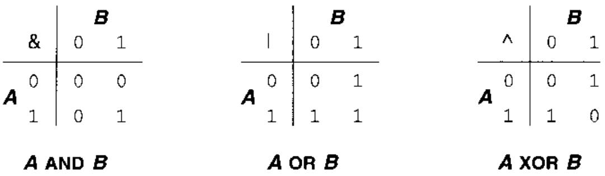

联合

联合的所有成员引用的是内存中的相同位置。当你想在不同的时刻把不同的东西存储在同一个位置时，就可以使用联合。\

sizeof关键字

统计数据类型所占内存大小

语法：sizeof(数据 or 变量);

switch语句

作用：执行多条件分支语句

语法：

```c++
switch(表达式)

{

​	case 结果1： 执行语句； break；

​	case 结果2： 执行语句； break；

​	...

​	default: 执行语句；break；

}
```

## 5 操作符和表达式

### 5.1 操作符

#### 5.1.1 算术操作符

#### 5.1.2 移位操作符

移位操作只是简单地把一个值的位向左或者向右移动。在向左移位中，值最左边的几位被丢弃，右边多出来的几个空位则由 0 补齐。右移位操作存在一个左移位操作不曾面临的问题：从左边移位进入新位时，可以选则两种方案。一种是逻辑移位，左边移入的位用 0 填充；另一种时算术移位，左边移入的位由原先该值的符号位决定，符号位为以则移入的均为 1，符号位为 0 则移入的位均为 0，这样能够保证原数的正负形式不变。算术左移和逻辑左移的是相同大的，它们只在右移时不同，而且只有当操作数是负值时才不一样。左移位操作符为 <<，右移位操作符为 >>。

#### 5.1.3 位操作符

位操作符对它们的操作数的各个位执行 AND，OR 和 XOR（异或）等逻辑操作。



#### 5.1.4 赋值

#### 5.1.5 单目操作符

~ 操作符对整形类型的操作数进行求补操作，操作数中所有原先为 1 的位变为 0，所有原先为 0 的位变为 1。

sizeof 操作符判断它的操作数的类型长度，以字节为单位。操作数既可以是个表达式（常常是单个变量），也可以是两边加上括号的类型名。

>   sizeof(int)			或者   		sizeof x

(类型) 操作符被称为**强制类型转换**，它用于显示地把表达式的值转换为另外的类型。

### 5.2 布尔值

### 5.3 左值和右值

### 5.4 表达式求值


## 8 预处理器

c 语言是一个编译型语言，那么在源代码中除了逻辑相关的代码部分，还有编译相关的代码部分。编译相关的代码部分主要是预处理相关的部分。

编译一个 c 程序有很多步骤。详细见编译原理部分。

c 预处理器在源码编译之前对其进行一些文本性质的操作。它的主要任务包括删除注释，插入被 `#include` 指令包含的文件的内容，定义和替换由 `#define` 指令定义的符号以及确定代码的部分内容是否应该根据一些条件编译指令进行编译。

## 预定义符号

下面总结了有预处理器定义的符号。它们的值或者是字符串常量，或者是十进制数字常量。`__FILE__` 和 `__LINE__` 在确认调试输出的来源方面很有用处。`__DATE__` 和 `__TIME__` 常常用于在被编译的程序中加入版本信息。`__STDC__` 用于那些在 ANSI 环境中和非 ANSI 中都必须进行编译的程序中结合条件编译。

| 符号       | 样例值        | 含义                                   |
| ---------- | ------------- | -------------------------------------- |
| `__FILE__` | "name.c"      | 进行编译的源文件名                     |
| `__LINE__` | 25            | 文件当前行的行号                       |
| `__DATE__` | "Jan 31 1997" | 文件被编译的日期                       |
| `__TIME__` | "18:04:30"    | 文件被编译的时间                       |
| `__STDC__` | 1             | 如果编译器遵循 ANSI 就为1， 否则未定义 |


## 2 #define

描述格式为：

```c
# define name stuff
```

有了上述指令，每当由符号 name 出现在这条指令后面时，预处理器就会把它替换成 stuff 

替换文本并不限于数值字面值常量。使用 #define 指令，你可以把任何文本替换到程序中。

如果定义中的 stuff 非常长，可以分成几行，除了最后一行之外，每行的末尾都要加一个反斜杠。下面是示例：

```c
#include "stdio.h"

#define DEBUG_PRINT printf("File %s is line %d:" \
                        " x=%d, y=%d, z=%d", \
                        __FILE__, __LINE__, \
                        x, y, z)

int main()
{
    int x = 3, y = 4, z = 5;
    x *= 2;
    y += x;
    z = x * y;
    DEBUG_PRINT;
    return 0;
}
```

不要滥用上述技巧，如果相同的代码需要出现在几个地方，更好的办法是实现为一个函数。

### 2.1 宏

#define 机制包括了一个规定，允许把参数替换到文本中，这种实现通常称为宏（macro）或定义宏（defined macro）。下面是宏的声明方式：

```c
#define name(parameter-list) stuff
```

其中，parameter-list（参数列表）是一个由逗号分隔的符号列表，他们可能出现在 stuff 中。参数列表的左括号必须与  name 相邻。如果两者之间有任何空白存在，参数列表就会被解释成 stuff 的一部分。

当宏被调用时，名字后面是一个由逗号分隔的值的列表，每个值都与宏定义的一个参数相对应，整个列表用一对括号包围。当参数出现在程序中时，与每个参数对应的实际值都将被替换到哦 stuff 中。

那么理论上，通过定义一套宏，用一种看上去很像其他语言的方式编写 c 程序是完全可能的，但是不应该这样做。

### 2.2 #define 替换

在程序中扩展#define定义符号和宏时，需要涉及几个步骤。

1．在调用宏时，首先对参数进行检查，看看是否包含了任何由#define定义的符号。如果是，它们首先被替换。

2．替换文本随后被插入到程序中原来文本的位置。对于宏，参数名被它们的值所替代。

3．最后，再次对结果文本进行扫描，看看它是否包含了任何由#define定义的符号。如果是，就重复上述处理过程。

这样，宏参数和#define定义可以包含其他#define定义的符号。但是，宏不可以出现递归。

详见 c 与指针 14.2.2 中阐述

### 2.3 宏与函数 

宏非常频繁地用于执行简单的计算，比如在两个表达式中寻找其中较大（或较小）的一个：

```c
#define MAX(a, b) ((a) > (b) ? (a) : (b)) // 想想看这里为啥加这么多括号
```

不用函数的原因有两个。首先是用于调用和从函数返回的代码很可能比实际执行这个小型计算工具的代码更大，所以使用宏比使用函数在程序的规模和速度方面更胜一筹。

最关键的是，函数的参数必须声明为一种特定的类型，所以它只能在类型合适的表达式上使用。反之，上面这个宏可以用于整形，长整型，单浮点型，双浮点数以及其他任何可以用 > 这个操作符比较值大小的类型。换句话说，宏是与类型无关的。

宏的不利之处在于每次使用时，一份宏定义代码的拷贝都将插入程序中。除非宏非常短，否则使用宏可能会大幅度增加程序的长度。

还有一些任务根本无法用函数实现。比如下面这个宏

```c
#define MALLOC(n, type) \
		((type *)malloc( (n) * sizeof(type)))
```

宏的第二个参数是一种类型，它无法作为函数参数进行传递。

### 2.4 带副作用的宏参数

#### 名称空间

对于同名函数，编译器不知道使用哪个版本的函数时，可以将其放入不同的名称空间，通过名称空间：：函数的方式调用函数。

#### 复合类型

从c语言继承下来的复合类型：数组，结构，指针。

数组：用来存储多个同类型的数据，创建数组使用声明语句，需要声明三点：

1.存储在数组中每个元素的值的类型

2.数组的名称

3.数组中的元素数。

通用格式：`typename name[arraysize]`，arraysize指定元素数目，它必须是整形常量或const值，也可以是常量表达式，即**其中的值在编译时是已知**的。具体地说，arraysize不能是变量，变量的值是在程序运行时设置的。（虽然这个规则非常的操蛋）但素，可以使用new运算符来避开这种限制。只有在定义数组时才能初始化，后续不能再初始化，不能用一个数组初始化另一个数组。

结构：用来存储多个不同类型的数据。

可以同时完成结构定义和创建结构变量的工作。只需将变量名称放在结束括号的后面即可。

结构中的位字段：

联合体，共用体（union)：可以存储不同的数据类型，但同时只能存储其中的一种类型。共用体通常用于节省内存。

枚举：一种创建符号常量的方式。默认情况下，将整数值赋给枚举量，第一个枚举量的值为0，第二个枚举量的值为1，依次类推。可以通过显式地指定整数值的方式覆盖默认值。在声明枚举量的时候，可以使用赋值运算符来显式地设置枚举量的值。

指针：用来告知计算机数据所处位置，使用指针来管理运行阶段的内存分配。指针无非是为可以通过名称访问的内存地址提供了一个别名，但其真正的用武之地是在运行阶段提供未命名的内存以保存值。在这种情况下，只能使用指针来访问内存。c语言中可以使用库函数malloc来分配内存，c++中仍然可以这样做，但是最好使用new运算符。为一个数据对象（可以是结构，也可以是基本数据类型）获得并指定分配内存的通用格式是：`typename *pointer_name = new typename` 只能用delete释放new分配的内存，不能用于释放声明变量获得的内存。

类：oop的堡垒。c++的灵魂

## typedef

c语言机制，允许为各种数据定义新名字。typedef声明的写法和普通的声明基本相同，只是把typedef这个关键字出现在声明的前面。例如，下面这个声明：

```c
char　　　*ptr_to_char;
```

把变量ptr_to_char声明为一个指向字符的指针。但是，在你添加关键字typedef后，声明变为：
`typedef　 char　 *ptr_to_char;`
这个声明把标识符ptr_to_char作为指向字符的指针类型的新名字。你可以像使用任何预定义名字一样在下面的声明中使用这个新名字。例如：
`ptr_to_char　　　a;`
声明a是一个指向字符的指针。
使用typedef声明类型可以减少使声明变得又臭又长的危险，尤其是那些复杂的声明。而且，如果你以后觉得应该修改程序所使用的一些数据的类型时，修改一个typedef声明比修改程序中与这种类型有关的所有变量（和函数）的所有声明要容易得多。

### 提示：

你应该使用typedef而不是#define来创建新的类型名，因为后者无法正确地处理指针类型。例如：
`#define　d_ptr_to_char　 char *`
`d_ptr_to_char　 a, b;`
正确地声明了 a，但是 b 却被声明为一个字符。因为 #define 只是简单的将d_ptr_to_char 转换成了char* , 然后语句变成了：

char *  a, b;(所以b为一个字符)

在定义更为复杂的类型名字时，如函数指针或指向数组的指针，使用typedef更为合适。