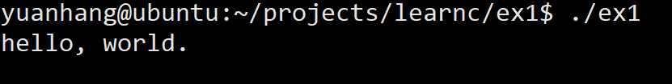

### 编辑器和环境准备

用编辑器写出喜闻乐见的输出helloworld的ex1.c吧

```c
int main(int argc, char *argv[])
{
    puts("Hello world.");

    return 0;
}

```

然后编译

`make ex1`

最后屏幕打印



如果你用的是linux系统加上你喜欢的编辑器，我使用的是vim，那么基本的开发环境已经搭建好啦。

### 附加

用 `man 3 puts` 命令来查看puts函数的手册。

`man`命令在linux系统中是一个很重要的命令。该手册分成很多section，使用man时可以指定不同的section来浏览，各个section意义如下： 
1 - commands
2 - system calls
3 - library calls
4 - special files
5 - file formats and convertions
6 - games for linux
7 - macro packages and conventions
8 - system management commands
9 - 其他

详见： [man命令](https://www.cnblogs.com/oxspirt/p/8137675.html)