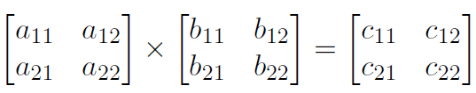
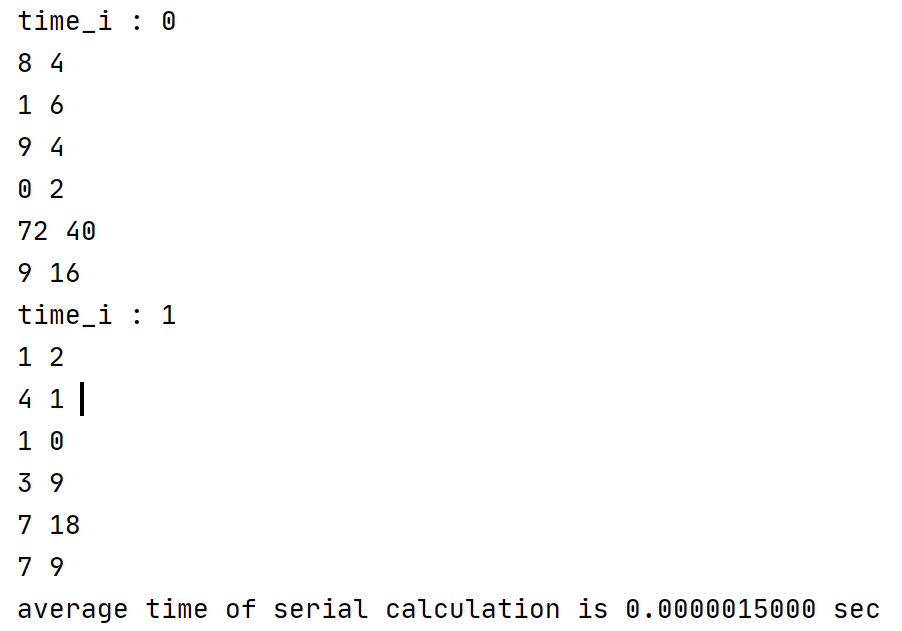
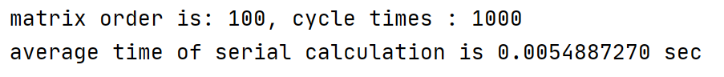
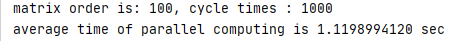
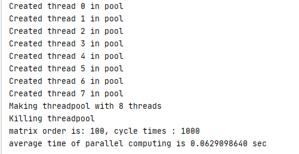
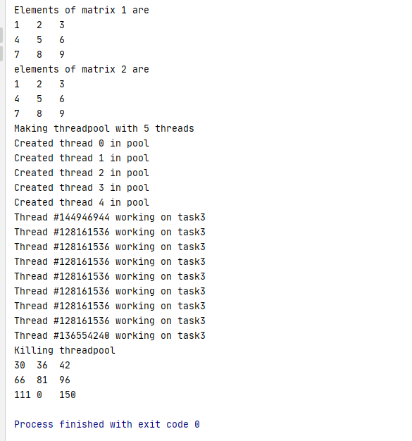

多线程编程

通过多线程编程加速 nxn 的矩阵乘法

cmakelists添加下面几句
FIND_PACKAGE(Threads)
TARGET_LINK_LIBRARIES(multi_thread ${CMAKE_THREAD_LIBS_INIT})
上面的 mutil_thread 是add_excutable()生成的执行文件
一个 2 阶矩阵相乘的例子



显然，$$c_{11}$$ 通过 [$$a_{11}$$, $$a_{12}$$] 与 $$ [b_{11}, b_{21}]^T $$ 相乘得到，做了两次乘法，一次加法。同理，得到矩阵 C 的其他元素也需要相同数量的乘法和加法。那么，设矩阵的阶数为 n，得到矩阵乘法的时间复杂度为 $$ O(n^3) $$。假如有 $ n^2 $ 个处理器并行工作，那么只需要做 n 次乘法运算即可完成矩阵乘法，时间复杂度降为 O(n)。

现在的计算机都是多核 cpu，每个核都可以看作一个独立的处理器。因此，将计算线程映射到每个核上可以显著提高整个算法的速度。现在的问题是如何用一个独立的线程实现向量相乘，从而实现矩阵乘法的并行运算。事实上，操作系统可以自动地将一个线程放到一个核上去执行，具体怎样实现的就不在本教程的范围内啦。当然，你可以创建数量超过处理器核心数量的线程，然后交给操作系统去安排如何调度执行这些线程。

本教程用 c 语言来实现多线程 $$ n*n $$ 矩阵乘法，并测量其运行性能。从 2*2 矩阵和 4 个线程开始，测量当增加 n 的值，从而增加线程数时，运行时的规模是怎样的。为了避免随机误差，同一个多线程乘法运行多次取平均值。

-   理论上，采用  $ n^2 $ 个线程时，可以达到 O(n) 的性能。但是，实现这一目标的可能性很小。这是为什么呢，下面通过实验来解释背后的原因

-   另一个需要考虑的问题是，性能如何随 n 和用于计算向量积的静态分配线程的数量而变化

-   是否有可能通过重用较小的线程池（小于 $$ n^2 $$）来实现近似相同的性能，其中每个线程执行两个或多个向量乘法的序列，通过实验来解释一下其中的原因。

-   机器的物理核心数量对性能有影响吗，缓存大小呢

在这个实验中，我们只考虑静态线程分配模型，其中在执行矩阵乘法之前创建一个足够大的**线程池**。这个方法比较容易实现。记录的时间只是矩阵乘法的持续时间。不包括创建/销毁线程的时间。解决方案只考虑执行矩阵乘法所花费的时间，而不是线程创建和销毁与操作系统相关的开销。

由于这是多线程编程，根据程序的组织方式，可能会遇到 race hazards，也就是说，一个线程偶尔会在另一个线程之前完成它的工作，结果有时会从不完整的结果中计算出答案。因此需要仔细考虑是否需要使用适当的同步机制。(显然，race hazards 是并发编程中的一个主要问题，也是许多软件灾难的根源!)

用于存储矩阵的数据结构由您决定，但是任何比二维数组更复杂的东西，比如专门的矩阵类，都可能给带来新问题。类似地，通过引用而不是值传递函数参数也是合理的。

本实验不使用 OpenMP 之类的复杂的并发平台。

当然可以用分治的方式实现将矩阵乘法的时间复杂度在单处理器上降低到 $$ O(n^2.81) $$，但是本实验目的是多线程编程，不考虑这种优化方式

本实验不涉及更改操作系统的线程调度方式。依赖操作系统的默认线程调度方式

本实验通过 c 语言实现，并利用 Linux 系统的标准 API

报告描述算法的性能

如果能找出决定多线程加速的关键因素，以及所采用的方法/方法的适当性，将会得到分数。

1.  介绍和演示使用单个线程执行乘法的基本情况[10%]

```c
#include <stdio.h>
#include <time.h>
#include <stdlib.h>
#include <memory.h>

/*Define the upper bound of the elements in the matrix to avoid overflows after multiplication*/
#define RANGE 10
/*The order of the square matrix*/
#define N 100

int rand_seed = 5;

#define REPETITION 1000

void gene_matrix(int **matrix);

void print_matrix(const int **matrix);

int main()
{
    setbuf(stdout, NULL);
    int matrixA[N][N] = {0};
    int matrixB[N][N] = {0};
    int res[N][N] = {0};
    double total_time = 0;
    for (int time_i = 0; time_i < REPETITION; ++time_i)
    {
//        printf("time_i : %d\n", time_i);
        //Random generation matrix
        gene_matrix((int **) matrixA);
        gene_matrix((int **) matrixB);
        //time start
        clock_t start = clock();
        int i, j, k;
        for (i = 0; i < N; i++)
            for (j = 0; j < N; j++)
                for (k = 0; k < N; k++)
                    res[i][j] += matrixA[i][k] * matrixB[k][j];
        //time end
        clock_t finish = clock();
//        print_matrix((const int **) (int **) matrixA);
//        print_matrix((const int **) (int **) matrixB);
//        print_matrix((const int **) (int **) res);
        memset(res, 0, N * N * sizeof(int));
        total_time += (double) (finish - start);
    }
    printf("matrix order is: %d, cycle times : %d\n", N, REPETITION);
    printf("average time of serial calculation is %.10f sec\n", (double) (total_time / REPETITION) / CLOCKS_PER_SEC);
    exit(0);
}

void gene_matrix(int **matrix)
{
    int i, j;
    for (i = 0; i < N; i++)
    {
        for (j = 0; j < N; j++)
        {
            rand_seed += rand();
            rand_seed = rand_seed % RANGE;
            *((int *) matrix + N * i + j) = rand_seed;
        }
    }
}

void print_matrix(const int **matrix)
{
    for (int i = 0; i < N; ++i)
    {
        for (int j = 0; j < N; ++j)
        {
            int tmp = *((int *) matrix + N * i + j);
            printf("%d ", tmp);
        }
        printf("\n");
    }
}
```

如上所示，为单线程执行矩阵乘法的演示代码。运行结果如下



可以看到，循环了两次，分别生成了两个不同的 2 维矩阵，使之相乘，并得到了正确的结果。由于两次计算得到的平均用时具有随机性。所以将重复次数设置为1000次，并将矩阵的阶数设置为100，得到单线程执行矩阵乘法的平均时间。



1.  将矩阵乘法分布在$$ n^2 $$个线程上的实现和演示，考虑足够大的N范围来得出合理的结论。(15%)

```c
#include <stdio.h>
#include <pthread.h>
#include <time.h>
#include <stdlib.h>
#include <memory.h>

#define N 2
#define REPETITION 1000
#define RANGE 10


int rand_seed = 5;

pthread_t hThread[N][N];
int pass[N][N][2];

int mat1[N][N];
int mat2[N][N];
int res[N][N];

void gene_matrix(int **matrix);

void print_matrix(const int **matrix);

void ThreadProc(int *param)
{
    int row = param[0];
    int col = param[1];
    int rs = 0;

    int loop;
    for (loop = 0; loop < N; ++loop)
    {
        rs += mat1[row][loop] * mat2[loop][col];
    }
    res[row][col] = rs;
}

int main()
{
    double total_time = 0;
    for (int time_i = 0; time_i < REPETITION; ++time_i)
    {
//        printf("time_i : %d\n", time_i);
        gene_matrix((int **) mat1);
        gene_matrix((int **) mat2);
        clock_t start = clock();
        int i, j;
        for (i = 0; i < N; i++)
        {
            for (j = 0; j < N; ++j)
            {
                pass[i][j][0] = i;
                pass[i][j][1] = j;
                pthread_create(&hThread[i][j], NULL, (void *) ThreadProc, pass[i][j]);
            }
        }

        for (i = 0; i < N; ++i)
        {
            for (j = 0; j < N; ++j)
            {
                pthread_join(hThread[i][j], NULL);
            }
        }
        clock_t finish = clock();
//        print_matrix((const int **)mat1);
//        print_matrix((const int **)mat2);
//        print_matrix((const int **)res);
        total_time += (double) (finish - start);
    }
    printf("average time of parallel computing is %.10f sec\n", (double) (total_time / REPETITION) / CLOCKS_PER_SEC);
    return 0;
}

void gene_matrix(int **matrix)
{
    int i, j;
    for (i = 0; i < N; i++)
    {
        for (j = 0; j < N; j++)
        {
            rand_seed += rand();
            rand_seed = rand_seed % RANGE;
            *((int *) matrix + N * i + j) = rand_seed;
        }
    }
}

void print_matrix(const int **matrix)
{
    for (int i = 0; i < N; ++i)
    {
        for (int j = 0; j < N; ++j)
        {
            int tmp = *((int *) matrix + N * i + j);
            printf("%d ", tmp);
        }
        printf("\n");
    }
}
```

如上所示，可以看到，循环了两次，分别生成了两个不同的 2 维矩阵，使之相乘，并得到了正确的结果。由于两次计算得到的平均用时具有随机性。所以将重复次数设置为1000次，并将矩阵的阶数设置为100次，得到单线程执行矩阵乘法的平均时间。



对上文(2)的结果进行分析和讨论。(15%)



为何同样的两个矩阵相乘，单线程的矩阵乘法的执行时间比起多线程快得那么多呢。我觉得应该是操作系统将大量的时间花在了线程调度上面。从而导致多线程的耗时远远大于单线程的矩阵乘法的耗时。


2.  将矩阵乘法分布在少于$$ n^2 $$个线程上的实现和演示，考虑足够大的N范围来得出合理的结论。(15%)

这就需要采用线程池技术了，因为频繁得创建和销毁线程需要占用大量的 cpu 时间。

1.  对上文(4)的结果进行分析讨论。(15%)

采用线程池技术后，

1.  考虑到处理器特性的整体分析/结果讨论。(15%)


1.  得出适当的结论。(15%)

参考资料：

https://www.cnblogs.com/s-lisheng/p/11244873.html

https://www.cnblogs.com/zhangchaoyang/articles/1853822.html

cuda, OpenMP, MPI的简单介绍：https://blog.csdn.net/weixin_42819452/article/details/102807147

多线程编程第一步，创建线程。创建线程其实是增加了一个控制流程，使得同一进程中存在多个控制流程并发或者并行执行。



线程创建函数

```c
#include<pthread.h>

int pthread_create(
        pthread_t *restrict thread,  /*线程id*/
        const pthread_attr_t *restrict attr,    /*线程属性，默认可置为NULL，表示线程属性取缺省值*/
        void *(*start_routine)(void*),  /*线程入口函数*/
        void *restrict arg  /*线程入口函数的参数*/
);
```

